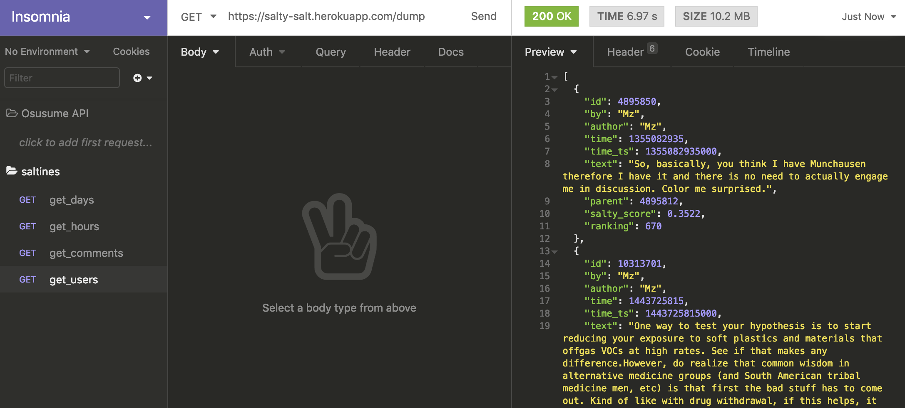
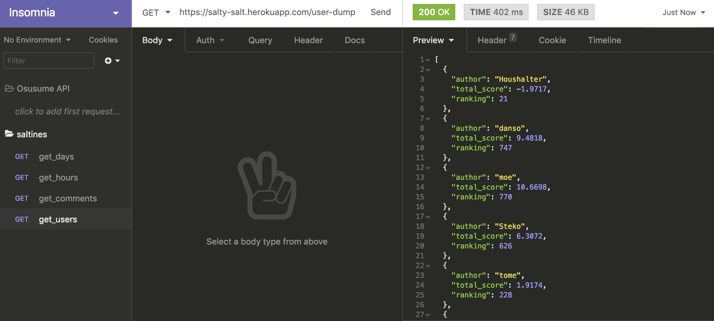

## Project: Hacker News Saltines
## Product Vision: [PV Document](https://www.notion.so/mkirby/Product-Vision-Document-65e4fa49eb8c4b52beb0a4388f13d097)
---

### ML-Engineers: Harsh Desai, Nick Burkhalter

## ETL Pipeline

## Flask API Endpoints

BASE URL = `https://salty-salt.herokuapp.com`

1. Top 100 Salty Users

GET: `https://salty-salt.herokuapp.com/salty-users` 

Returns: 

2. Top 100 Salty Comments

GET: `https://salty-salt.herokuapp.com/salty-comments` 

Returns: 

3. Most Saltiest Comments of a User

GET: `https://salty-salt.herokuapp.com/user-comments/<user-name>` 

Example, user `wnight`
GET: `https://salty-salt.herokuapp.com/user-comments/wnight`

Returns:

4. Dump

GET: `https://salty-salt.herokuapp.com/dump`
Returns:

5. User Dump
GET: `https://salty-salt.herokuapp.com/user-dump`

RETURNS:

